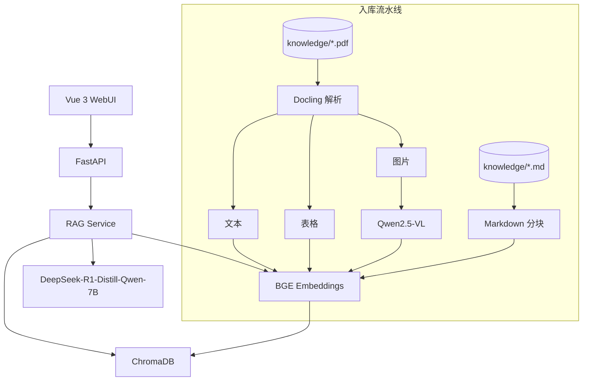

# VisionText-RAG

本地多模态 RAG 问答系统：支持 **Markdown** 与 **PDF** 知识库，使用 **DeepSeek-R1-Distill-Qwen-7B** 推理、**BGE** 向量检索、**Qwen2.5-VL** 图片描述，回答附带可折叠引用来源。

[](LICENSE)

## 特性

- **本地推理**：LLM / Embedding / VLM 均可离线运行，数据不出本机
- **多格式知识库**：`.md` 直接分块；`.pdf` 经 Docling 解析文本、表格与图片
- **PDF 多模态**：表格转 Markdown 入库；图片由 Qwen2.5-VL 生成描述后向量化
- **引用溯源**：回答标注来源文件、页码、内容类型（文本 / 表格 / 图片描述）
- **GPU 加速**：支持 NVIDIA CUDA（含 RTX 50 系列），LLM 可选 4bit 量化
- **一键启停**：`start.bat` / `stop.bat`，WebUI 聊天界面支持 Markdown 渲染

## 架构



## 技术栈

| 层级 | 技术 |
|------|------|
| 后端 | FastAPI、ChromaDB、Docling |
| 前端 | Vue 3、Vite、marked、highlight.js |
| LLM | DeepSeek-R1-Distill-Qwen-7B（4bit 量化可选） |
| Embedding | BAAI/bge-small-zh-v1.5 |
| VLM | Qwen2.5-VL-3B-Instruct（PDF 图片描述） |

## 目录结构

```
VisionText-RAG/
├── backend/          # FastAPI + RAG 服务
├── frontend/         # Vue 3 WebUI
├── knowledge/        # 知识库（.md / .pdf）
├── models/           # 本地模型权重（不提交 Git）
├── scripts/          # 下载、启动、停止脚本
├── chroma/           # ChromaDB 持久化（自动生成）
└── docs/             # 架构、变更日志、提交规范
```

## 环境要求

- **Python** 3.10+
- **Node.js** 18+
- **GPU**（推荐）：NVIDIA 12GB+ 显存；CPU 可运行但较慢
- **磁盘**：模型合计约 **23 GB**（LLM ~15 GB + VLM ~7.5 GB + Embedding ~100 MB）

## 快速开始

### 1. 克隆仓库

```powershell
git clone https://github.com/Nomnori/VisionText-RAG.git
cd VisionText-RAG
```

### 2. 下载模型

通过 [hf-mirror.com](https://hf-mirror.com) 国内镜像下载（需稳定网络，大文件支持断点续传）：

```powershell
# 全部模型（LLM + Embedding + VLM）
.\scripts\download-models.ps1

# 或仅下载 VLM
.\scripts\download-vlm.ps1
```

模型存放于 `models/`，详见 [`models/README.md`](./models/README.md)。

**RTX 50 系列（sm_120）** 需安装 CUDA 版 PyTorch：

```powershell
.\scripts\install-gpu-torch.ps1
```

### 3. 配置环境

```powershell
copy .env.example .env
```

按需修改模型路径、设备、PDF/VLM 开关等，参见 [`.env.example`](./.env.example)。

### 4. 启动服务

双击 `start.bat`，或：

```powershell
.\start.ps1
```

- 后端 API：<http://localhost:8000>
- 前端 WebUI：<http://localhost:5173>

停止服务：

```powershell
.\stop.bat
```

### 5. 导入知识库并提问

1. 将 `.md` / `.pdf` 放入 `knowledge/`（仓库自带示例 Markdown 文档）
2. 在 WebUI 左侧点击 **重建索引**
3. 在聊天框提问，展开引用查看来源

## 示例知识库

`knowledge/` 目录包含一组高校教务相关示例文档（培养方案、选课规定、奖学金办法、课程大纲等），可直接用于体验 RAG 效果。替换或删除这些文件后重建索引即可使用自己的知识库。

## API 接口

| 方法 | 路径 | 说明 |
|------|------|------|
| GET | `/api/health` | 健康检查、模型与索引状态 |
| GET | `/api/knowledge` | 列出知识库文件 |
| POST | `/api/ingest` | 重建向量索引 |
| POST | `/api/chat` | 问答（答案 + 引用来源） |

## 文档

- [文档索引](./docs/README.md)
- [架构说明](./docs/ARCHITECTURE.md)
- [变更日志](./docs/CHANGELOG.md)
- [Git 提交规范](./docs/GIT_COMMIT_CONVENTION.md)

## 开发约定

1. 功能或配置变更请更新 [`docs/CHANGELOG.md`](./docs/CHANGELOG.md)
2. 提交信息遵循 [Conventional Commits](./docs/GIT_COMMIT_CONVENTION.md)

## 仓库信息

- **远程**: https://github.com/Nomnori/VisionText-RAG
- **维护者**: [Nomnori](https://github.com/Nomnori)

## License

[MIT](./LICENSE)
