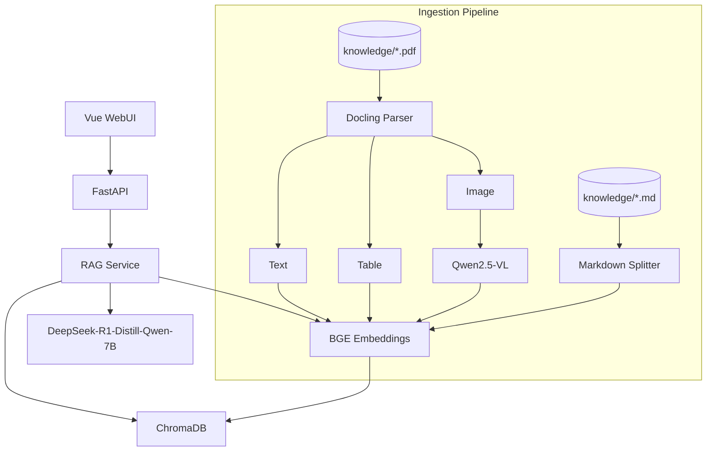

# 架构说明

## 总览



## 模块职责

| 模块 | 路径 | 职责 |
|------|------|------|
| WebUI | `frontend/` | 聊天、索引管理、多模态引用来源展示 |
| API | `backend/app/api/` | REST 接口 |
| Ingestion | `backend/app/services/ingestion.py` | MD/PDF 统一入库调度 |
| PDF Parser | `backend/app/services/pdf_parser.py` | Docling 解析 PDF 文本/表格/图片 |
| VLM | `backend/app/services/vlm.py` | Qwen2.5-VL 图片描述 |
| Vector Store | `backend/app/services/vectorstore.py` | ChromaDB 索引与检索 |
| Embeddings | `backend/app/services/embeddings.py` | 文本向量化 |
| LLM | `backend/app/services/llm.py` | 本地模型推理 |
| RAG | `backend/app/services/rag.py` | 检索 + 生成 + 引用组装 |

## PDF 多模态入库

```
PDF
 ├─ Text   → Embedding → ChromaDB
 ├─ Table  → Markdown  → Embedding → ChromaDB
 └─ Image  → Qwen2.5-VL → Description → Embedding → ChromaDB
```

索引完成后 VLM 模型会卸载以释放显存，问答时使用 LLM。

## 引用来源

每条引用包含：

| 字段 | 说明 |
|------|------|
| `file_type` | `markdown` / `pdf` |
| `content_type` | `text` / `table` / `image` / `markdown` |
| `modality_label` | 文本 / 表格 / 图片描述 |
| `page_number` | PDF 页码（如有） |

WebUI 引用面板默认折叠，展示类型徽章与页码。

## 数据格式

- **Markdown（`.md`）**：直接分块索引
- **PDF（`.pdf`）**：Docling + Qwen2.5-VL 多模态解析

## 模型

| 用途 | 默认模型 |
|------|----------|
| LLM 问答 | DeepSeek-R1-Distill-Qwen-7B |
| Embedding | BGE-small-zh-v1.5 |
| VLM 图片描述 | Qwen2.5-VL-3B-Instruct |
