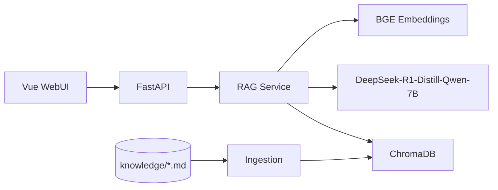

# 架构说明

## 总览

## 模块职责

| 模块 | 路径 | 职责 |
|------|------|------|
| WebUI | `frontend/` | 聊天、索引管理、引用来源展示 |
| API | `backend/app/api/` | REST 接口 |
| Ingestion | `backend/app/services/ingestion.py` | Markdown 读取与分块 |
| Vector Store | `backend/app/services/vectorstore.py` | ChromaDB 索引与检索 |
| Embeddings | `backend/app/services/embeddings.py` | 文本向量化 |
| LLM | `backend/app/services/llm.py` | 本地模型推理 |
| RAG | `backend/app/services/rag.py` | 检索 + 生成 + 引用组装 |

## 引用来源流程

1. 用户提问 → Embedding 检索 Top-K 文本块
2. 将检索结果作为上下文注入 Prompt
3. LLM 生成回答，正文中标注 `[1][2]` 等引用编号
4. API 同时返回 `sources` 数组，包含来源文件、标题、片段与相关度
5. WebUI 在回答下方展示引用卡片

## 数据格式

知识库仅支持 **Markdown（.md）** 文件，建议：

- 一文件一主题
- 使用 `# 标题` 作为文档标题
- 支持子目录组织

## MVP 范围

- ✅ Markdown 知识库 RAG
- ✅ 引用来源
- ✅ Vue WebUI
- ⬜ 多模态（图片/OCR）— 后续迭代
- ⬜ Streamlit 管理面板 — 可选后续添加
